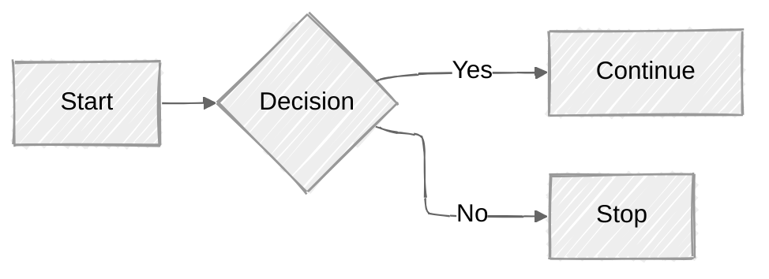
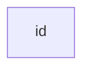

```mermaid
---
config:
  layout: elk
  look: handDrawn
  theme: neutral
---
flowchart LR
  A[Start] --> B{Decision}
  B -->|Yes| C[Continue]
  B -->|No| D[Stop]
```

```mermaid
---
title:node
---
flowchart LR
  id

```
